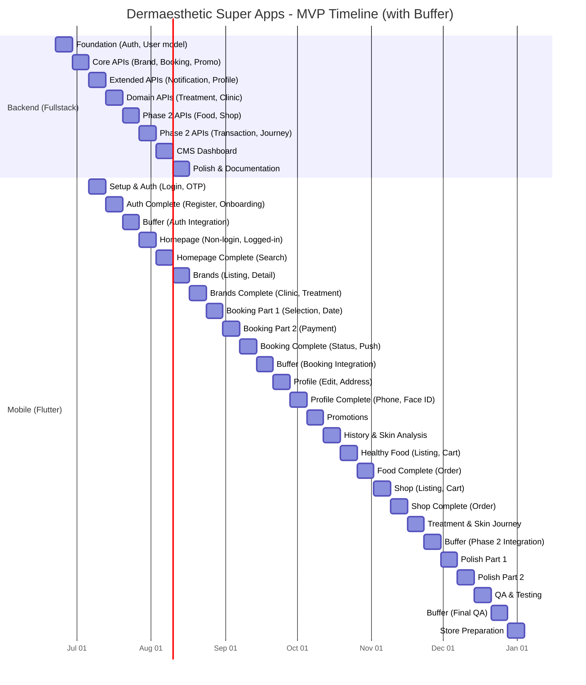
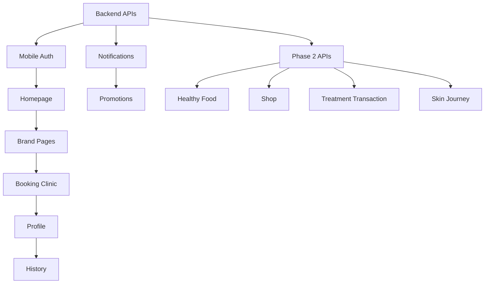

# Dermaesthetic Super Apps - MVP Development Roadmap

**Date:** 2026-06-17
**Status:** Draft - Pending Approval
**Approach:** Phased Parallel Streams (Approach C)
**Deferred:** Laundry, Loyalty & Membership

---

## Executive Summary

| Metric | Value |
|--------|-------|
| Total Features | 14 (11 Phase 1 + 3 Phase 2) |
| Total Sprints | 28 weeks (1 sprint = 1 week) |
| Buffer Weeks | 4 weeks (strategic placement) |
| Team | 2 Flutter devs, 2 Fullstack (CMS/BE) |
| Timeline | June 2026 → January 2027 |
| CTO Target | Beat by ~5 months |

---

## Buffer Strategy

**Buffer Placement Rationale:**

| Buffer | Week | Purpose |
|--------|------|---------|
| BUF-1 | 5 | Auth integration testing, Bug fixes after critical auth flow |
| BUF-2 | 13 | Booking integration testing, Payment flow validation |
| BUF-3 | 23 | Phase 2 integration testing, Cross-feature validation |
| BUF-4 | 27 | Final QA, Regression testing, App store prep validation |

**Buffer Usage Rules:**
1. Buffer weeks are for **integration testing and bug fixes**, not new features
2. Buffer weeks can be used for **documentation and code reviews**
3. Buffer weeks can be used for **performance optimization**
4. Buffer weeks **cannot be used for scope expansion**
5. If no issues arise, buffer weeks can be used for **technical debt reduction**

---

## Team Allocation

| Role | Count | Responsibility |
|------|-------|----------------|
| Flutter Developer 1 | 1 | Mobile app (Android + iOS) |
| Flutter Developer 2 | 1 | Mobile app (Android + iOS) |
| Fullstack Developer 1 | 1 | Backend APIs + CMS |
| Fullstack Developer 2 | 1 | Backend APIs + CMS |

**Critical Path:** Mobile development (2 Flutter devs)
**Parallel Work:** Backend APIs can be built 1-2 weeks ahead of mobile consumption

---

## Epic Breakdown

### Epic 1: Authentication & Onboarding
**Priority:** P0 (Critical Path)
**Sprint:** 3-5

#### Story 1.1: Login
| Task | Subtasks | Estimate |
|------|----------|----------|
| Login screen UI | Email input, Password input, Login button, Divider, Social logins | 2 days |
| OTP verification | Phone input, OTP input (6 digit), Resend timer, Verification API | 2 days |
| State management | Form validation, Loading states, Error handling | 1 day |

#### Story 1.2: Register
| Task | Subtasks | Estimate |
|------|----------|----------|
| Register screen UI | Name, Email, Phone, Password, Confirm password, Register button | 2 days |
| Phone verification | OTP send, OTP verify, Phone validation | 1 day |
| Email verification | Email OTP, Verification flow | 1 day |
| State management | Form validation, Loading, Error handling | 1 day |

#### Story 1.3: Forgot Password
| Task | Subtasks | Estimate |
|------|----------|----------|
| Email input screen | Email input, Send reset link button | 0.5 day |
| Reset password screen | New password, Confirm password, Submit | 0.5 day |
| Success screen | Confirmation message, Back to login | 0.5 day |
| API integration | Reset request, Password update | 0.5 day |

#### Story 1.4: Onboarding Tutorial
| Task | Subtasks | Estimate |
|------|----------|----------|
| Tutorial screens | 3-4 intro screens with illustrations | 1 day |
| Navigation | Skip button, Next/Previous, Get Started | 0.5 day |
| First-launch detection | Store flag in local storage | 0.5 day |

---

### Epic 2: Homepage
**Priority:** P0
**Sprint:** 6-7

#### Story 2.1: Non-Login Homepage
| Task | Subtasks | Estimate |
|------|----------|----------|
| Hero banner | Carousel/promo banner | 1 day |
| Brand section | Brand cards horizontal scroll | 1 day |
| Promotion section | Promotion cards | 0.5 day |
| Bottom navigation | Login CTA, nav items | 0.5 day |

#### Story 2.2: Logged-In Homepage
| Task | Subtasks | Estimate |
|------|----------|----------|
| Search bar | Search input with icon | 0.5 day |
| Brand carousel | Brand cards horizontal scroll | 1 day |
| Booking CTA | Quick booking button | 0.5 day |
| Promotion section | Promotion cards | 0.5 day |
| History preview | Recent booking history | 1 day |
| Profile preview | User avatar, name | 0.5 day |

#### Story 2.3: Search
| Task | Subtasks | Estimate |
|------|----------|----------|
| Search screen | Search input, Results grid | 1 day |
| Search API | Query, Filter, Debounce | 1 day |
| Search results | Brand cards, Treatment cards | 1 day |

---

### Epic 3: Brand Pages
**Priority:** P0
**Sprint:** 8-9

#### Story 3.1: Brand Listing
| Task | Subtasks | Estimate |
|------|----------|----------|
| Brand list screen | Grid/list view, Filter/Sort | 1.5 days |
| Brand card component | Image, Name, Rating, Location | 1 day |
| Brand API | List endpoint, Pagination, Filters | 1 day |
| Pull-to-refresh | Refresh indicator, Reload data | 0.5 day |

#### Story 3.2: Brand Detail
| Task | Subtasks | Estimate |
|------|----------|----------|
| Brand header | Logo, Name, Rating, Location, Description | 1 day |
| Treatment list | Treatment cards with prices | 1 day |
| Clinic list | Clinic cards with distance | 1 day |
| Brand API | Detail endpoint, Related data | 1 day |

#### Story 3.3: Clinic Page
| Task | Subtasks | Estimate |
|------|----------|----------|
| Clinic header | Name, Address, Map link | 0.5 day |
| Clinic details | Operating hours, Contact | 0.5 day |
| Available treatments | Treatment list for this clinic | 1 day |
| Clinic API | Detail endpoint | 0.5 day |

#### Story 3.4: Treatment Page
| Task | Subtasks | Estimate |
|------|----------|----------|
| Treatment header | Name, Image, Description | 0.5 day |
| Treatment details | Duration, Price, Pre-care, Post-care | 1 day |
| Book now CTA | Navigate to booking | 0.5 day |
| Treatment API | Detail endpoint | 0.5 day |

---

### Epic 4: Booking Clinic
**Priority:** P0 (Critical Path - Complex)
**Sprint:** 10-12

#### Story 4.1: Clinic Selection
| Task | Subtasks | Estimate |
|------|----------|----------|
| Clinic selector | Dropdown/modal for clinic choice | 1 day |
| Clinic search | Search within brand | 0.5 day |
| Clinic card | Selected clinic display | 0.5 day |

#### Story 4.2: Treatment Selection
| Task | Subtasks | Estimate |
|------|----------|----------|
| Treatment list | Available treatments for clinic | 1 day |
| Treatment selection | Select one or multiple | 1 day |
| Price summary | Total price calculation | 0.5 day |

#### Story 4.3: Date & Time Picker
| Task | Subtasks | Estimate |
|------|----------|----------|
| Calendar component | Month view, Date selection | 1.5 days |
| Time slot picker | Available time slots | 1 day |
| Availability API | Fetch available slots | 1 day |

#### Story 4.4: Booking Confirmation
| Task | Subtasks | Estimate |
|------|----------|----------|
| Booking summary | Clinic, Treatment, Date, Time, Price | 1 day |
| User confirmation | Confirm button, Terms checkbox | 0.5 day |
| Booking API | Create booking endpoint | 1 day |

#### Story 4.5: Payment
| Task | Subtasks | Estimate |
|------|----------|----------|
| Payment method selection | Doku integration | 1 day |
| Payment processing | Payment API integration | 1.5 days |
| Payment success | Receipt, Confirmation screen | 1 day |
| Payment failure | Error handling, Retry | 0.5 day |

#### Story 4.6: Booking Status
| Task | Subtasks | Estimate |
|------|----------|----------|
| Booking status screen | Pending, Confirmed, Completed, Cancelled | 1 day |
| Status updates | Real-time status via polling/websocket | 1 day |

---

### Epic 5: Profile Management
**Priority:** P1
**Sprint:** 13-14

#### Story 5.1: Profile Page
| Task | Subtasks | Estimate |
|------|----------|----------|
| Profile header | Avatar, Name, Email, Phone | 1 day |
| Profile menu | Settings options list | 0.5 day |
| Profile API | Get/Update profile | 0.5 day |

#### Story 5.2: Edit Profile
| Task | Subtasks | Estimate |
|------|----------|----------|
| Edit profile form | Name, Email, Phone inputs | 1 day |
| Avatar upload | Camera/Gallery picker | 1 day |
| Save changes | API update, Validation | 0.5 day |

#### Story 5.3: Address Management
| Task | Subtasks | Estimate |
|------|----------|----------|
| Address list | Saved addresses | 0.5 day |
| Add address | Form with fields | 1 day |
| Edit address | Edit existing | 0.5 day |
| Delete address | Confirmation, Remove | 0.5 day |
| Address API | CRUD endpoints | 1 day |

#### Story 5.4: Change Phone
| Task | Subtasks | Estimate |
|------|----------|----------|
| Current phone display | Masked phone number | 0.5 day |
| New phone input | Phone input with country code | 0.5 day |
| OTP verification | Verify new phone | 1 day |
| Phone update API | Update endpoint | 0.5 day |

#### Story 5.5: Change Password
| Task | Subtasks | Estimate |
|------|----------|----------|
| Current password | Password input | 0.5 day |
| New password | Password input with strength indicator | 0.5 day |
| Confirm password | Match validation | 0.5 day |
| Password update API | Update endpoint | 0.5 day |

#### Story 5.6: Face ID
| Task | Subtasks | Estimate |
|------|----------|----------|
| Face ID setup | Biometric permission | 0.5 day |
| Face ID toggle | Enable/Disable setting | 0.5 day |
| Face ID login | Biometric authentication | 1 day |
| Platform integration | iOS Face ID, Android Biometric | 1 day |

#### Story 5.7: Privacy Settings
| Task | Subtasks | Estimate |
|------|----------|----------|
| Privacy toggles | Data sharing, Marketing consent | 0.5 day |
| Privacy API | Get/Update preferences | 0.5 day |

#### Story 5.8: Contact Support
| Task | Subtasks | Estimate |
|------|----------|----------|
| Support form | Message input, Category | 1 day |
| Submit support | API submission | 0.5 day |
| Support history | Previous tickets | 0.5 day |

---

### Epic 6: Notifications
**Priority:** P1
**Sprint:** 11

#### Story 6.1: Notification Center
| Task | Subtasks | Estimate |
|------|----------|----------|
| Notification list | Grouped by date, Read/Unread | 1 day |
| Notification detail | Full notification content | 0.5 day |
| Mark as read | Tap to read, Mark all read | 0.5 day |
| Notification API | List endpoint, Pagination | 1 day |

#### Story 6.2: Push Notifications
| Task | Subtasks | Estimate |
|------|----------|----------|
| FCM setup | Firebase Cloud Messaging | 1 day |
| Token registration | Device token storage | 0.5 day |
| Notification handling | Background/Foreground handling | 1 day |
| Deep linking | Navigate to relevant screen | 0.5 day |

---

### Epic 7: Promotions
**Priority:** P1
**Sprint:** 9

#### Story 7.1: Promotion Listing
| Task | Subtasks | Estimate |
|------|----------|----------|
| Promotion list | Grid view, Filter by category | 1 day |
| Promotion card | Image, Title, Discount, Expiry | 0.5 day |
| Promotion API | List endpoint, Filters | 1 day |
| Pull-to-refresh | Refresh indicator | 0.5 day |

#### Story 7.2: Promotion Detail
| Task | Subtasks | Estimate |
|------|----------|----------|
| Promotion detail | Full image, Terms, Conditions | 1 day |
| Use promotion | Navigate to booking/shop | 0.5 day |
| Share promotion | Share sheet | 0.5 day |

---

### Epic 8: History
**Priority:** P1
**Sprint:** 14

#### Story 8.1: Booking History
| Task | Subtasks | Estimate |
|------|----------|----------|
| History list | Past bookings, Status indicators | 1 day |
| History filter | Date range, Status filter | 0.5 day |
| History detail | Booking details, Receipt | 1 day |
| History API | List endpoint, Pagination | 1 day |

#### Story 8.2: Rebook
| Task | Subtasks | Estimate |
|------|----------|----------|
| Rebook button | Quick rebook from history | 0.5 day |
| Pre-fill booking | Copy previous booking details | 0.5 day |

---

### Epic 9: Skin Analysis
**Priority:** P1
**Sprint:** 14

#### Story 9.1: Skin Analysis Questionnaire
| Task | Subtasks | Estimate |
|------|----------|----------|
| Questionnaire screen | Multiple choice questions | 1.5 days |
| Progress indicator | Step counter, Progress bar | 0.5 day |
| Question types | Single select, Multi select, Scale | 1 day |
| Questionnaire API | Save responses, Get questions | 1 day |

#### Story 9.2: Skin Analysis Results
| Task | Subtasks | Estimate |
|------|----------|----------|
| Results screen | Skin type, Recommendations | 1 day |
| Product recommendations | Related products | 0.5 day |
| Save results | Store analysis locally | 0.5 day |

---

### Epic 10: Healthy Food
**Priority:** P2 (Phase 2)
**Sprint:** 15-16

#### Story 10.1: Healthy Food Listing
| Task | Subtasks | Estimate |
|------|----------|----------|
| Food listing | Grid view, Categories | 1 day |
| Food card | Image, Name, Price, Rating | 0.5 day |
| Food API | List endpoint, Filters | 1 day |
| Category filter | Filter by food type | 0.5 day |

#### Story 10.2: Food Detail
| Task | Subtasks | Estimate |
|------|----------|----------|
| Food detail | Image, Description, Nutrition | 1 day |
| Add to cart | Quantity selector | 0.5 day |
| Food API | Detail endpoint | 0.5 day |

#### Story 10.3: Food Cart
| Task | Subtasks | Estimate |
|------|----------|----------|
| Cart screen | Items list, Total price | 1 day |
| Quantity update | Increase/Decrease/Remove | 0.5 day |
| Checkout | Delivery address, Payment | 1 day |
| Cart API | CRUD endpoints | 1 day |

#### Story 10.4: Food Order
| Task | Subtasks | Estimate |
|------|----------|----------|
| Order confirmation | Order summary | 0.5 day |
| Order tracking | Status updates | 1 day |
| Order history | Past orders | 0.5 day |
| Order API | Create, Track, List endpoints | 1 day |

---

### Epic 11: Shop
**Priority:** P2 (Phase 2)
**Sprint:** 16-17

#### Story 11.1: Shop Listing
| Task | Subtasks | Estimate |
|------|----------|----------|
| Product listing | Grid view, Categories | 1 day |
| Product card | Image, Name, Price, Rating | 0.5 day |
| Shop API | List endpoint, Filters | 1 day |
| Search products | Search with filters | 1 day |

#### Story 11.2: Product Detail
| Task | Subtasks | Estimate |
|------|----------|----------|
| Product detail | Images, Description, Specs | 1 day |
| Add to cart | Quantity, Variants | 0.5 day |
| Reviews | User reviews, Ratings | 1 day |
| Product API | Detail endpoint | 0.5 day |

#### Story 11.3: Shop Cart
| Task | Subtasks | Estimate |
|------|----------|----------|
| Cart screen | Items list, Total price | 1 day |
| Quantity update | Increase/Decrease/Remove | 0.5 day |
| Promo code | Apply discount code | 0.5 day |
| Checkout | Address, Shipping (JNE), Payment (Doku) | 1.5 days |
| Cart API | CRUD endpoints | 1 day |

#### Story 11.4: Shop Order
| Task | Subtasks | Estimate |
|------|----------|----------|
| Order confirmation | Order summary, Receipt | 0.5 day |
| Order tracking | Shipping status, JNE tracking | 1 day |
| Order history | Past orders | 0.5 day |
| Order API | Create, Track, List endpoints | 1 day |

---

### Epic 12: Treatment Transaction
**Priority:** P2 (Phase 2)
**Sprint:** 17

#### Story 12.1: Transaction List
| Task | Subtasks | Estimate |
|------|----------|----------|
| Transaction list | All transactions, Status | 1 day |
| Transaction filter | Date, Status, Type | 0.5 day |
| Transaction API | List endpoint, Pagination | 1 day |

#### Story 12.2: Transaction Detail
| Task | Subtasks | Estimate |
|------|----------|----------|
| Transaction detail | Full details, Receipt | 1 day |
| Invoice download | PDF generation | 1 day |
| Transaction API | Detail endpoint | 0.5 day |

---

### Epic 13: Skin Journey
**Priority:** P2 (Phase 2)
**Sprint:** 17-18

#### Story 13.1: Skin Journey Page
| Task | Subtasks | Estimate |
|------|----------|----------|
| Journey timeline | Vertical timeline, Milestones | 1.5 days |
| Milestone cards | Treatment dates, Progress | 1 day |
| Journey API | Get journey data | 1 day |

#### Story 13.2: Progress Tracking
| Task | Subtasks | Estimate |
|------|----------|----------|
| Progress chart | Before/After photos | 1 day |
| Progress notes | User notes per milestone | 0.5 day |
| Photo upload | Camera/Gallery | 1 day |
| Progress API | Upload, Get endpoints | 0.5 day |

---

## Backend API Breakdown

### Sprint 0 (Weeks 1-2): Foundation
| Week | Tasks |
|------|-------|
| Week 1 | Project setup, Auth APIs (Login, Register, OTP, Forgot Password), User model, Database schema |
| Week 2 | Brand APIs (List, Detail), Booking APIs (Create, List, Status), Promotion APIs (List, Detail) |

### Sprint 1 (Weeks 3-4): Core APIs
| Week | Tasks |
|------|-------|
| Week 3 | Notification APIs (List, Mark read), Profile APIs (Get, Update, Address CRUD), Search API |
| Week 4 | Treatment APIs (List, Detail), Clinic APIs (List, Detail), Skin Analysis APIs (Save, Get) |

### Sprint 2 (Weeks 5-6): Phase 2 APIs
| Week | Tasks |
|------|-------|
| Week 5 | Healthy Food APIs (List, Detail, Cart, Order), Shop APIs (List, Detail, Cart, Order) |
| Week 6 | Treatment Transaction APIs (List, Detail), Skin Journey APIs (Get, Update), Integration testing |

### Sprint 3 (Weeks 7-8): CMS & Polish
| Week | Tasks |
|------|-------|
| Week 7 | CMS dashboard (React/Next.js), Content management for promotions, brands |
| Week 8 | API documentation, Performance optimization, Security audit |

### Buffer Sprints (Weeks 9-10): Integration & Security
| Week | Tasks |
|------|-------|
| Week 9 | Integration testing, Bug fixes, API documentation updates |
| Week 10 | Performance optimization, Security audit, Final API adjustments |

---

## Weekly Sprint Plan

### Backend Sprints (Fullstack Devs)

| Sprint | Week | Focus | Deliverables |
|--------|------|-------|--------------|
| B-1 | 1 | Foundation | Project setup, Auth APIs, User model, DB schema |
| B-2 | 2 | Core APIs | Brand, Booking, Promotion APIs |
| B-3 | 3 | Extended APIs | Notification, Profile, Search APIs |
| B-4 | 4 | Domain APIs | Treatment, Clinic, Skin Analysis APIs |
| B-5 | 5 | Phase 2 APIs | Healthy Food, Shop APIs (Cart, Order) |
| B-6 | 6 | Phase 2 APIs | Treatment Transaction, Skin Journey APIs |
| B-7 | 7 | CMS | Dashboard, Content management |
| B-8 | 8 | Polish | Documentation, Optimization, Security |
| B-9 | 9 | Buffer | Integration testing, Bug fixes, API documentation |
| B-10 | 10 | Buffer | Performance optimization, Security audit |

### Mobile Sprints (Flutter Devs)

| Sprint | Week | Focus | Deliverables |
|--------|------|-------|--------------|
| M-1 | 3 | Setup & Auth | Flutter project, Login screen, OTP verification |
| M-2 | 4 | Auth Complete | Register, Forgot Password, Onboarding tutorial |
| **BUF-1** | **5** | **Buffer** | **Auth integration testing, Bug fixes, Documentation** |
| M-3 | 6 | Homepage | Non-login homepage, Logged-in homepage |
| M-4 | 7 | Homepage Complete | Search functionality, Brand carousel |
| M-5 | 8 | Brands | Brand listing, Brand detail |
| M-6 | 9 | Brands Complete | Clinic page, Treatment page |
| M-7 | 10 | Booking (Part 1) | Clinic selection, Treatment selection, Date picker |
| M-8 | 11 | Booking (Part 2) | Time picker, Booking confirmation, Payment |
| M-9 | 12 | Booking Complete | Booking status, Push notifications |
| **BUF-2** | **13** | **Buffer** | **Booking integration testing, Payment flow validation, Bug fixes** |
| M-10 | 14 | Profile | Profile page, Edit profile, Address management |
| M-11 | 15 | Profile Complete | Change phone, Change password, Face ID, Privacy |
| M-12 | 16 | Promotions | Promotion listing, Promotion detail |
| M-13 | 17 | History & Skin | Booking history, Skin analysis questionnaire |
| M-14 | 18 | Phase 2 Start | Healthy Food listing, Food detail, Food cart |
| M-15 | 19 | Food Complete | Food order, Order tracking |
| M-16 | 20 | Shop | Shop listing, Product detail, Shop cart |
| M-17 | 21 | Shop Complete | Shop order, Order tracking |
| M-18 | 22 | Treatment & Journey | Treatment transaction, Skin journey |
| **BUF-3** | **23** | **Buffer** | **Phase 2 integration testing, Cross-feature validation, Bug fixes** |
| M-19 | 24 | Polish (Part 1) | UI polish, Animation, Performance |
| M-20 | 25 | Polish (Part 2) | Bug fixes, Edge cases, Accessibility |
| M-21 | 26 | QA & Testing | Integration testing, E2E testing |
| **BUF-4** | **27** | **Buffer** | **Final QA, Regression testing, App store prep validation** |
| M-22 | 28 | Store Prep | App store assets, Submission, Release |

---

## Gantt Chart

---

## Risk Register

| Risk | Impact | Mitigation |
|------|--------|------------|
| Flutter dev bottleneck | High | Backend APIs ready 1-2 weeks ahead, parallel development |
| Doku payment integration issues | Medium | Early integration testing, Fallback payment method |
| JNE delivery integration issues | Medium | Early API testing, Mock for development |
| App store rejection | Medium | Follow guidelines, Pre-submission review |
| Scope creep | High | Strict MVP scope, Deferred features documented |
| Team burnout | Medium | Realistic sprint loads, Buffer weeks included |
| Buffer week misuse | Medium | Buffer weeks are for integration testing and bug fixes, not new features |
| Integration issues | High | Buffer weeks placed after critical features (Auth, Booking, Phase 2) |
| Timeline slippage | Medium | 4 buffer weeks provide 17% schedule flexibility |

---

## Dependencies

---

## Approval Checklist

- [ ] Epic breakdown approved
- [ ] Sprint plan approved
- [ ] Gantt chart approved
- [ ] Risk register reviewed
- [ ] Dependencies validated
- [ ] Deferred features confirmed (Laundry, Loyalty)
- [ ] Timeline accepted (28 weeks mobile with 4 buffer weeks, 10 weeks backend with 2 buffer weeks)
- [ ] Buffer week placement approved
- [ ] Buffer usage rules approved
